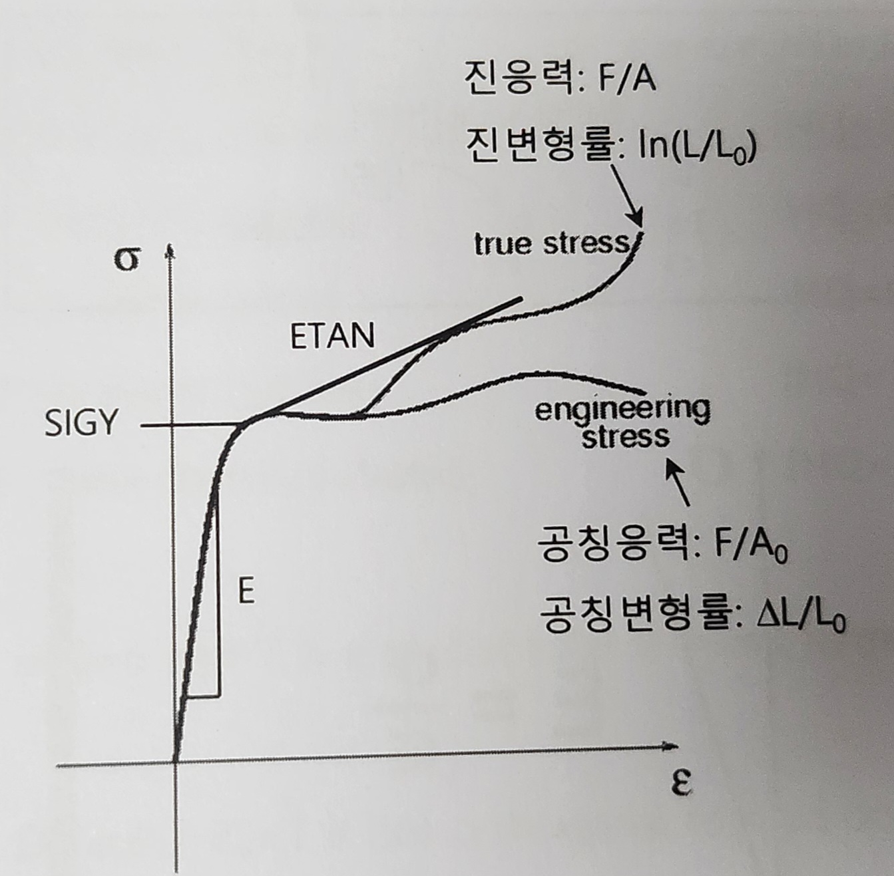

> ⚠️ **LS-DYNA 용어 정의**

이 문서에서 사용되는 **LS-DYNA**는  
**Livermore Software Technology Corporation (LSTC)** 에서 개발된 **기존 LS-DYNA**를 의미합니다.

이는 **Ansys에 인수되기 전의 독립적인 LS-DYNA 버전**을 지칭하며,  
**Ansys LS-DYNA (Explicit + Implicit 통합 버전)** 과는 구분됩니다.

또한, 문서 내에서 다음 표현은 모두 같은 의미로 사용됩니다:

- **LS-DYNA**
- **lsdyna**
- **dyna**

즉, 본 문서에서는 모두 **LSTC 개발 버전의 LS-DYNA**를 가리킵니다.

> ⚙️ **기능 명칭 표기 규칙 정의**

이 문서에서는 LS-DYNA의 GUI 기능을 설명할 때 다음과 같은 명명 규칙을 사용합니다:

- `기능그룹__세부기능` 형식으로 표기합니다.  
  (`__`는 GUI에서의 메뉴 계층 구조를 나타냅니다)

### 예시
- `element tools__offset`  
  → GUI 우측의 `element tools` 버튼 클릭 후, 나오는 메뉴에서 `offset` 항목 선택  

> 이러한 명명 규칙은 메뉴 경로를 명확히 전달하고,  
GPT가 질문에 따라 정확한 기능 위치를 안내할 수 있도록 돕습니다.

> 📜 ** fringe / fringing 용어 정리 **

In LS-DYNA, "fringing" is a post-processing technique that plots the relative displacement of a model. 
You can perform fringing in different directions, such as the element, global, or material direction. 

> 📌 **"추천" 용어 정의**

이 문서에서 사용되는 **"추천"**, **"권장"**, 또는 **"사용을 권함"** 등의 표현은  
모두 **KOSTECH 사의 LS-DYNA 공식 교육 과정** 중  
**전문 강사가 실제로 추천하거나 강조한 방법/설정/절차**를 기반으로 합니다.

따라서 문서 내에서 해당 표현이 나올 경우,  
이는 일반적인 의견이 아닌 **KOSTECH 사 실무 전문가의 권장사항**임을 의미합니다.

> 📜 **Hourglass 현상** 용어어 정의

Hourglass란 **저차원 적분 요소(Reduced Integration Element)** 사용 시 발생할 수 있는 **비물리적인(Non-physical) 변형 모드**를 의미합니다.
요소가 변형하나 응력 및 변형률일 발생하지 않는 상태 → 'Zero-Energy'
ELFORM 중 하나의 적분점을 사용하는 shell 및 solid(hexahedrons) 요소에서 발생.

이 현상의 발생원인은
1) 집중하중 : 일부의 노드에 집중적으로 외력이 작용할 시
2) Contact : 접촉면에서의 힘이 일부 노드에 과중하게 작용 시

Hourglass 발생확인 방법 : CONTROL_ENERGY의 HGEN=2(hourglass)로 설정 후, GLSTAT과 MATSUM 파일에서 hourglass energy를 확인 (DATABASE_GLSTAT, DATABASE_MATSUM 추가 설정 후)

Hourglass 해결방법 : 
1) 집중 하중 회피 : 일부의 노드에 집중적으로 힘이 가해지지 않도록 외력에 대한 하중을 힘 대신 압력 타입으로 적용
2) CONTROL_HOURGLASS 또는 HOURGLASS 키워드를 사용하여 hourglassing 제어 
  - CONTROL_HOURGLASS : 전체 해석 모델을 위한 hourglass type 및 coefficient 설정
  - HOURGLASS : 특정 파트를 위한 hourglassing type 및 coefficient 설정 (overrides global setting), PART의 HGID HOURGLASS ID 선택
  - Fully integrated element type 사용
3) 최종적으로 변형에너지 (internal Energy)의 최대값 대비 HG Energy가 10% 이내를 유지하도록 한다. 

> 📜 **shear locking** 용어어 정의

shear locking 또는 shearlocking 현상이란, 굽힘 변형 시, 강성이 높아지는 현상을 의미합니다.
매우 얇은 shell 요소를 사용하는 경우, 전단 강성이 실제보다 과대평가되어 오차를 유발하는 현상
발생원인 : 적분점에서 전단응력이 발생하는 경우, D.O.F가 부족한 경우(Rx, Ry, Rz), Fully integrated 요소의 경우 
해결방법 : 요소의 종횡비를 좋게함 (good aspect ratio를 가지게 함), 두께 방향으로 3개 이상의 요소를 사용함, Shell 요소 사용, Tetra보다는 Hexa 요소가 좋음

> 📌 **"expensive" 용어 정의**

이 문서에서 사용되는 **"expensive"** 라는 표현은  
**“계산 비용이 많이 드는”** 또는 **“해석 시간이 많이 걸리는”** 상황을 의미합니다.

즉, expensive는 **경제적 비용**을 뜻하는 것이 아니라  
**시뮬레이션 수행 시 계산량이 많아 실행 시간이 길어지는 경우**를 나타냅니다.

예:
- "This option is computationally expensive."  
→ 이 옵션을 사용할 경우 **해석 시간이 많이 소요됨**을 의미

> 📌 **"contact" 용어 정의**

이 문서에서 사용되는 **"contact"**는  
일반적인 사람 간의 접촉 또는 연락 의미가 아닌,  
**유한 요소 해석(FEA, 특히 LS-DYNA)**에서의 **물리적인 접촉 조건**을 의미합니다.

즉, 구조물 해석 과정에서  
**두 개 이상의 요소(Element) 또는 파트(Part)가 충돌하거나 맞닿는 상황**에서  
그 물리적 상호작용을 계산하기 위한 **접촉 알고리즘(Contact algorithm)** 을 뜻합니다.

---

# LS-DYNA LS-PrePost 사용법

## Mesh Generation (메쉬생성)
[키워드 : mesh, mesh작업, ] 
- 정확한 값을 원한다면, 정삼각형, 정사각형, 정육면체 메쉬가 이상적임

### Element Tools
- Element Tools__Offset : Shell을 normal 방향으로 띄울 때 자주 사용

---

## Keyword Input (키워드 작성)
[키워드 : Card, 물성카드, 카드, ]

### MAT 
- 재질의 종류 및 특성에 다른 옵션 선택 : (선형, 비선형), (탄성, 가소성, 강체), (이방성, 등방성), (복합재, 고무, 폼재료, 콘크리트, 폭발물, 혼합 가스, 스프링/댐퍼, 용접 등)
- 구조적, 열적 특성 정의
- 파단 조건 정의 (일부 물성 카드에서)

#### MAT_ELASTIC (001)
- 등방성 탄성 소재의 재료 특성값을 적용할 때 사용되는 재료 모델이며, beam, shell, solid 요소 모델에서 사용이 가능함
- DA : 축방향에 대한 댐핑
- DB : 밴딩관련

#### MAT_PLASTIC_KINEMATIC (003)
- strain rate 효과를 포함한 등방경화(isotropic hardening)과 시험편을 인장하중을 이용하여 소성화시키고 제하한 후에 압축하중을 가하였을 때, 앞서 인장하중에 의해 경화된 것 보다 낮은 응력에서 재 항복이
  일어나는 바우싱거 효과를 수치적으로 표현한 이동경화(kinematic hardening)을 모델링하는데 적합한 재료 모델임. beam, shell, solid에서 사용할 수 있음

#### MAT_PIECEWISE_LINEAR_PLASTICITY (024)
- 많은 재료에서 거의 다 이 키워드를 사용함
- 단축인장 시험 결과를 바탕으로 등방성 탄소성 소재의 재료 특성 값을 적용할 때 사용되는 재료모델이며, 소성 구간의 특성을 정의하는 방법은 소성구간을 정의할 수 있는 자료에 따라서
  tangent modulus, Max.8 point의 table, S-S curve을 통해서 소성구간을 정의할 수 있다. 이 때 소성구간을 정의하는 값은 진응력, 진변형률 값을 바탕으로 정의하며, beam(ELFORM=1), shell, solid 에 사용 가능함
- E : 탄성계수, 탄성영역의 기울기
- SIGY : 항복강도, 소성변형을 일으키는 지점에서의 응력. 만약 SIGY값이 정의되지 않았다면, ES1의 값 또는 LCSS에서 정의되는 소성구간의 첫 번재 응력값이 항복응력으로 사용됨
- ETAN : 접선 탄성계수, 항복강도 지점으로부터 소성영역을 직선으로 표현. 소성구간을 tangent moduls 적용하여, 1차로 정의할 때 사용. 만약 LCSS가 정의되면 ETAN값이 무시됨
  
- LS-dyna의 ss커브(응력-변형률선도)는 **진응력**과 **진변형률**로 정의
- FAIL : 파단조건(failure)을 적용할 때 사용되며, 이 때 적용되는 값은 소성 변형률(plastic strain)값을 사용한다.
  해석에서 파단을 묘사하는 방법은 요소가 변형할 때 발생하는 plastic strain 값이 failure strain 값에 도달되었을 때 해당요소를 삭제하면서 파단을 묘사한다. (즉 FAIL값보다 높을 때 파단됨)
- LCSS : 소성구간의 SS curve가 정의된 DEFINE_CURVE 또는 strain rate가 고려된 DEFINE_TABLE의 ID를 선택하여 소재의 소성구간 특성을 해석모델에 반영할 때 사용
  SS Curve의 양의 방향은 인장이며, 압축 시 자동으로 대칭되어 사용.
- EPS1~8(strain) : LCSS 대신 SS Curve의 일부 포인트 (최대 8개) 입력. (SS Curve 데이터가 충분하지 않은 경우 사용)
- ES1~8(stress) : LCSS 대신 SS Curve의 일부 포인트 (최대 8개) 입력. (SS Curve 데이터가 충분하지 않은 경우 사용)

#### MAT_RIGID (020)
- 강체를 정의할 때 사용되는 재료 모델. 재료 모델에서 CMO, CON1, CON2 변수를 통해서 Global 또는 Local 좌표상에서의 구속조건을 적용할 수 있음. beam, shell, solid 에서 가능함
- MID, RO, E, PR등은 작성해야 하며, 강체지만 접촉조건을 주기 위해 이런 물성이 필요하다.

---

### SECTION : Element Formulation (ex.tetra or Hexa element) 정의 및 요소 형태에 따라 평면 또는 체적에서의 stress와 strain을 계산하기 위한 적분점(integration point)을 정의 할 때 일반적으로 사용됨

#### SECTION_SHELL
- ELFORM : Element Formulation options 정의
  - Shell 타입에서 ELFORM의 값은 주로 2번이나 16번을 추천한다. 
    1) EQ.2 : Belytschko-Tsay (one point integretion), 적분점 위치가 하나임.
      - Exteremely effective : Formulated in velocity strains (rate of deformations) and Cauchy stresses
      - Hourglass 현상은 올라갈 수 있다 → Hourglass card를 사용하거나, CONTROL_HOURGLASS를 사용
        : GLSTAT에서 Hourglass Energy 값이 나오며, 이 값을 5% 이내, 또는 없음으로 조정해야 함
      - Warping stiffness (BWC flag on *CONTROL_SHELL)
      - Warpage may be an issue; do not use in coarse stiffness
      - invariant node numbering (*CONTROL_ACCURACY) 사용 불 필요
    2) EQ.16 : fully integrated shell element with EAS-formulation (2x2 integration), 적분점 위치가 4개.
      - Hourglass 현상 감소, Bathe-Dvorkin (AS) transverse shear correction eliminates W-mode hourglassing
      - 빈도높은 Hourglass는 대부분 잡아주나, 필요에 따라서 Hourglass, IHQ = 8 로 설정하면 더 좋아질 수 있음 (may improve convergence)
      - 해석시간은 증가
      - Recommended for implicit simulations
    3) EQ.5 : ELFORM값이 5인 경우는, fabric물성에서만 사용되며, 에어백 해석에서 사용된다. 이때 SECTION_SEHLL의 NIP값은 1이 default이다.
      - Bending stiffness가 없는 Membrane element
- SHRF : Shear Factor. Defualt값은 1.0, 5/6 을 추천하며, 두께에 일정한 횡 방향 shear stress를 계산할 때 사용
- NIP : 각 절점에서의 두께 방향으로의 stress, strain을 계산하는 적분점 개수를 정의 (Default = 2 point Gauss)
  대부분의 애플리케이션에서 NIP =2는 충분하지 않으므로, 다음의 규칙에 따라 두께에 따른 integration point의 수를 정의해야함 :
  1) for membranes : 1 integration point
  2) for linear material : 2 integration point sufficient
     but shell top, bottom면의 stress를 출력하려면 → NIP=5(in SECTION_SHELLL), INTGRD=2(in CONTROL_SHELL, Labatto integration)
     *Gauss-integration이 ls-dyna의 default로, 적분점이 5개여도 top면과 bottom면에서 약간 안쪽에서부터 시작하여 5 point를 찍지만, Labatto의 경우 top면과 bottom면부터 시작함
  3) non-linear material 을 사용한 경우, integration point 를 3 to 5 (or more)개 사용해야함
  4) springback simulation의 경우, 정확도를 위해 두께방향으로 7 to 9개 integration point를 사용
  5) NIP를 10개 이상 허용하면, 오히려 정확성이 많이 떨어짐. 대부분 NIP=5~7개로 홀수를 적용한다.
- NLOC : 3D shell element을 정의할 때 사용되는 reference surface의 위치를 설정. top, mid, bottom 위치에서 reference surface를 설정. (Default = 0 (mid surface))
  NLOC=0이면, 중간지점에 잡힌다
  NLOC=-1이면, bottom면에 reference surface가 잡히며, bottom면에서부터 위 방향으로 두께를 인식함
  NLOC=1이면, top면에 reference surface가 잡히며, top면에서부터 아래 방향으로 두께를 인식함
  반드시 **CONTROL_SHELL에서 CNTCO=1**로 지정해줘야만, NLOC가 -1이나 1일때 설정대로 먹히게 됨. (이것을 지정안하면 NLOC는 값에 상관없이, 중간지점에 잡힌다)

#### SECTION_SOLID 
- ELFORM : Element Formulation options 정의할 때 사용
  - Solid 타입에서 ELFORM의 값은 주로 hexahedron일때는 1번, 2번을 추천하고, tetra일때 13번을 추천한다.
  - Shell 타입의 경우, fully integrated가 해석정확도가 좋은데(EQ=2 < EQ=16), Solid의 경우는 EQ=1을 추천함. (shear locking 현상으로, 더 stiff한 것으로 인식함, 변형이 심한 경우도 EQ=1 추천함)
    대표적으로 판재성형 등을 해석할 때, EQ=2로 하면 shear locking 현상이 발생하는데, shear locking은 눈에 보이지 않으며 해석은 잘 돌아가므로, 기준이 되는 무언가와 비교하면서 체크가 필요함
    EQ=1로 할 경우, Hourglass Control type 6 (IHQ=6, QM=1) 과 결합된 solid type은 선형 bending 문제를 매우 잘 해결하지만, 이 설정에서는 전체적으로 모델이 stiff함
  - 가로:세로:높이 = 1:1:1인 경우(good aspect ratio)가 가장 좋으나, 부품의 너무 두께가 얇거나 하면 poor aspect ratio를 가지게 되며, shear locking 현상이 발생할수 있어 EQ를 -1또는 =2를 추천함
    EQ를 -1이나 -2를 사용하면, shear locking현상은 나타나지 않으나, 해석시간이 너무 걸린다는 단점이 있음 (2~5배 소요)
    1) EQ.1 : Constant stress solid element (one-point integration), default값.
      - Hourglass modes possible : *HOURGLASS : IHQ=6(solid일때 쓰는 option), QM =1
    2) EQ.2 : Fully integrated S/R solid (2x2x2 integration)
      - fully integrated with 8 integration points, 8개의 적분점
      - no Hourglass modes
      - 2~3 times more expensive than ELFORM = 1
      - handicap : lower deformations obtained as with type 1
      - handicap : shear locking if bad aspect ratio, bending 문제에 대한 aspect ratio에 매우 민감하여 shear locking 현상이 발생함.
    3) EQ.13 : 1 point nodal pressure tetrahedron
      - 1 point constant stress with nodal pressure averaging
      - nearly no volumeric locking
      - 10~40% more expensive than type 10
      - only available for material models : 1, 3, 6, 24, 77, 81, 82, 91, 92, 106, 120, 123, 124, 128, 129, 181, 183, 224, 225, 244 (웬만한 물성카드에 다 쓰임)
      - large plastic deformation과 rubber material에 추천함
    - ELFORM을 선정하기에 앞서, mesh작업 후의 geometry를 정리하는 것이 좋음.(edge부 정리 등) 이를 geometry clean이라고 하는데, 업체별 spec, 기준준등이 구글에도 있다고 함

---

### LOAD : 해석 시 다양한 형태의 하중(Force, Moment, Pressure, Gravity, THERMAL)을 구조물에 정의할 때 사용됨. 이 때 시간에 대한 하중을 정의하기 위해서 항상 DEFINE_CURVE가 필요함. 이때 Curve는 하중 형태에 따라서 Force vs Time, Pressure vs Time 등으로 정의됨
- 하중 적용시 주의사항 : 물리적으로 비현실적이며, 또는 Hourglass mode를 발생시킬 수 있기때문에 절점 하나에 집중되는 하중을 피한다.
- 구조물의 강도 해석 시 순간적으로 하중(impulse)을 적용하면, 구조물에 과도 응답이 발생하기 때문에 순간적인 하중을 적용하는 것을 피하는 것이 좋다.

#### LOAD_NODE_option : 하중타입은 힘, 모멘트
- node, node set에 집중하중을 적용할 때 사용함. 집중하중은 무게 중심에서 적용되며, 모멘트는 가본적으로 전체 좌표계의 축 방향으로 적용됨.
- DOF : 힘 또는 모멘트가 적용되는 자유도를 설정할 떄 사용

#### LOAD_BODY_X(_Y, _Z) : 하중타입은 중력(가속도), 전체 모델에 대해 각 X,Y,Z 축방향 또는 벡터방향으로 가속도 설정
#### LOAD_SEGMENT_option : 하중타입은 압력

---

### BOUNDARY (Conditions) : node ID, set_node ID, rigid part ID를 통해서 정의된 경계 node에 motion(fixed, free, move etc)을 정의할 때 사용함

#### BOUNDARY_SPC : Node에 구속조건을 적용할 때 사용함. 즉, 노드의 자유도를 구속
- SPC : single point constraint
- node의 6개의 자유도를 구속 (dof x y z rx ry rz, 0=free, 1=fixed)

#### BOUNDARY_PRESCRIBED_MOTION : Node 또는 rigid body에 강제로 motion(속도, 가속도, 변위)을 적용할 떄 사용, 구조해석에서 많이 사용됨
- Node, set of nodes, rigid body에 강제 운동을 정의
- 1-자유도에 대해서 적용할 수 있으며, 2개 이상의 option을 사용하여, motion의 중첩을 할 수 있음
- 강제운동은 : velocity vs time, acceleration(node only) vs time, dispalcement vs time 가능
- Motion curve(LCID)에 따라서 강제 운동이 정의됨

---

### DEFINE :box, coordinate systems, load curves, material curves, table 및 material의 orientation vector등을 정의할 때 사용함

#### DEFINE_COORDINATE
- local coordinate system을 정의할 때 사용되며, 3개 node 또는 global coordinate system의 위치정보를 사용하여 local coordinate system의 각 축 방향성을 정의할 수 있다.
- DEFINE_COORDINATE_NODES: 3개의 node를 이용하여 local coordinate system을 생성
  - N1 : Local coordinate system의 원점을 정의할 때 사용
  - N2 : Local coordinate system의 x축 상에 있는 node ID를 사용
  - N3 : DIR=X인 경우, local의 xy평면에 위치한 node ID를 사용
  - DIR : 원점 N1에서 이동한 N2에 의해 정의도니 축 (default : X축) 
- DEFINE_COORDINATE_SYSTEM : 3지점의 위치정보를 이용하여 local coordinate system을 생성
  - XO, YO, ZO : Local coordinate system의 원점 좌표(x,y,z)을 정의할 때 사용
  - XL, YL, ZL : Local coordinate system의 x축 상에 있는 좌표 (x,y,z)을 정의할 때 사용
  - XP, YP, ZP : local의 xy평면에 위치한 좌표(x,y,z)을 정의할 때 사용

#### DEFINE_CURVE
- 재료의 소성적인 특성, 하중조건 및 거동을 정의할 때 사용되며, 정의하고자 하는 물리적 특성에 따라서 Define curve의 특성이 달라진다.
  1) material의 경우 : stress(y축), strain(x축)
  2) load 의 경우 : load(y축), time(x축)
  3) motion 의 경우 : displacement or velocity or acceleration(y축), time(x축)
- SIDR : Stress initialization을 해석 시 Dynamic relaxation 해석에 Define curve의 적용여부를 설정할 때 사용
- SFA : X축 좌표값에 대해 scale factor을 적용할 때 사용
- SFO : Y축 좌표값에 대해 scale factor을 적용할 때 사용
- OFFA : X축 좌표값에 대해서 offset을 적용할 때 사용
- OFFO : Y축 좌표값에 대해서 offset을 적용할 때 사용
- 만약 단축 인장시험의 데이터 및 하중 데이터를 적용할 때는 LS-Prepost에서 작업하는 것보다 Edit 프로그램을 사용하면 쉽게 재료적인 특성 및 하중 데이터를 적용할 수 있음음

#### DEFINE_TABLE
- 한 예로 strain rate의 특성을 표현하기 위해서, strain rate 기준에 따라 여러개의 define_curve들로 정의된 재료의 물리적 특성을 strain rate별로 define_curve를 grouping할 때 사용된다.
  즉, define_curve의 묶음을 define_table로 정의할 수 있음

---

### RIGIDWALL_PLANAR
- FE 모델 없이 강체 표면 생성
- CONTACT 설정 필요 없음 : Rigidwall의 N-vector 방향에 있는 모든 노드와 접촉함

---

### PART : PART_PART, PART_CONTACT, PART_INERTIA 정도만 사용함

#### PART_INERTIA : Rigid에만 적용 가능함, 무게중심을 바꿀 수 있음, 해당 파트에 무게 인가가 가능, 속도도 줄 수 있음. Rigid 파트에 무게중심, 무게를 바꿀 때 사용함

#### PART_CONTACT : Friction을 적용할 수 있으며, 각각의 part에 대해서 마찰관련 변수들을 정의할 수 있음
- part 고유의 마찰 계수를 정의할 수 있음
- HGID : Hourglass 관련으로 많이 사용함
- OPTT : contact thickness를 조정. SECTION_SHELL 등에 들어가는 두꼐와는 별개의 개념이며, contact시 접촉할 때만 적용되는 두께로, 역시 많이 사용하는 기능 중 하나임.
  *Contact Thickness : Contact시 thickness offset을 결정함, Shell의 강성이나 질량에 영향을 주지 않음. 기본적으로 Shell thickness를 적용함
   이 기능을 사용하기보다는, 초기 penetration을 체크해서 가능한 없애는 방향을 추천함

---

### INITIAL : 해석 모델에 초기 조건을 정의할 때 사용함
- 초기조건 적용 시 주의 사항 :
  1) 초기 조건이 정의되지 않으면 항상 "0"으로 간주함
  2) 초기조건보다 경계조건(boundary conditions)이 우선하기 때문에 초기조건을 구조물에 적용 했을 때 구조물이 반응하지 않으면 경계조건을 확인

#### INITIAL_VELOCITY : 충돌, 관통, 낙하 해석 때 가장 많이 사용하며, part가 아닌 node에 속도가 부여된다.
- NSID : 초기속도를 적용하고자 하는 노드 셋 아이디 선택. NSID=0을 설정하면, 모든 노드에 적용된다.
- NSIDEX : 선택한 노드 셋 외의 모든 노드에 적용
- VX, VY, VZ : 각 축방향의 직선 방향에 대한 속도값
- VXR, VYR, VZR : 각 축방향의 회전 방향에 대한 속도값 (단위 : radian)

---

### CONTACT : 서로 떨어져있는 lagrangian 요소간에 서로 상호작용을 정의할 때 사용, 즉 대상들 간의 접촉이며 두가지 타입이 있음
- Penalty method : part간에 impact/push/slide/rub 현상 떄 사용, 즉 충돌이나 충격 관련, 일반적으로 생각하는 '접촉'에 가까움 
  - CONTACT_(AUTOMATIC)_NODES_TO_SURFACE (Slave : OK, Master : OK)
  - CONTACT_(AUTOMATIC)_SURFACE_TO_SURFACE (Slave : OK, Master : OK)
  - CONTACT_(AUTOMATIC)_SINGLE_SURFACE (Slave : OK, Master : NO), slave만 있기때문에 self contact임

- Constraint method : parts간에 함께 묶어서 자유도를 구속할 때 사용
  - CONTACT_SPOTWELD (spot weld beam & shell) : spot weld beams과 shells 을 연결할 때 사용함
  - CONTACT_TIED_SURFACE_TO_SURFACE
  - CONTACT_TIED_NODES_TO_SURFACE
  - CONTACT_TIEBREAK_SURFACE_TO_SURFACE
  - CONTACT_TIEBREAK_NODES_TO_SURFACE
  - CONTACT_TIED_SHELL_EDGE_TO_SURFACE_CONSTRAINED_OFFSET (OFFSET : 2D에 contact thickness 반영함) : shell 과 shell을 연결할 때 사용

- Slave와 Master 기준
  - Slave : 다른 surface에 impact / sliding 을 줄 수 있는 대상을 선택. 즉 보통 움직이는 대상을 선택.
    대부분의 contact들 내부에 이산화된 point로 표현됨 (node로 표현된다고 보여짐)
    contact의 안정성을 위해서, 더 fine mesh 대상을 선택. 즉 mesh가 더 작은 대상을 slave로 선택, 서치가 더 잘 먹힘
    또한 보통 질량 밀도 차이가 큰 경우, 재료 밀도가 가장 가벼운 쪽이 master여야 함 (하지만 밀도보다는 fine한 메쉬를 우선시함)
  - Master : slave, 즉 imapct /sliding 하는 surface에서 바라보는 대상을 선택 (접촉을 받는 대상)
    내부에 surface가 생성됨. 일반적으로 slave보다 rough한 대상을 선택
  - 예를 들어 CONTACT_NODES_TO_SURFACE 키워드이면, NODES가 slave, SURFACE가 master가 된다고 보면 됨
 
- Self/Single surface : Contact에서 slave만 정의되며, slave만 필요한 contact card.
  - 자기 자신 surface에 impact/sliding을 가하는 대상에 적용
  - 복잡한 구조물 내부 부품들 간에 slave와 master정의가 힘든 경우에 적용
  - self contact이기때문에, master에 대한 입력은 하지 않음
  - slave/master 처리가 상황에 따라 교체되면서 contact이 정의됨
  - CONTACT_(AUTOMATIC_)SINGLE_SURFACE 권장
  - CONTACT_AUTOMATIC_GENERAL 은 self contact시 접촉이 안되거나, edge끼리 contact이 발생하는 경우에 사용하며, beam-to-beam contact에서 탁월함
  - Contact Force에 대한 데이터 출력을 위해서는 : 단순히 DATABASE_RCFORC 에서 contact force를 출력하면, contact force data가 출력되지 않음.
    따라서, CONTACT_FORCE_TRANSDUCER_PENALTY 옵션을 추가로 사용하여 contact force를 출력할 대상을 선택하여 contact force를 출력해야함.
    *RCFORC는 slave와 master가 둘 다 있어야 출력됨. 따라서 CONTACT_FORCE_TRANSDUCER_PENALTY 옵션을 추가해야하며, 여러 파트 중 A의 contact force를 보고싶으면 slave쪽에 a를 넣으면 출력됨
     (Slave만 지정하거나 Slave와 Master 둘다 지정할 수 있음)
 
- Contact 알고리즘 : 두가지 step으로 구성됨
  1) step1. penetration check : penetration을 찾기 위한 방법
     - Nodal-base Search : contact이론의 기본이며, ls-dyna 에서 사용되는 모든 contact에서 slave search는 공통사항.
       - slave node에서 가장 가까운 node를 master segment상에서 찾는 방법
       - mesh가 불균일이거나 불연속일 경우 search fail
       - nodes_to_surface 컨택에서 사용됨
     - Segment-base search : bucket sorting approach
       - master의 형상이 복잡하다보니 접촉과는 상관없는 master의 node가 서칭되는 경우에 사용
       - slave node에서 가장 가까운 3개의 master segment를 찾는 방법 (segment를 파악 후, 그 segment의 node를 다시 서칭하므로 더 효과적이고, contact이 잘 안먹히는 경우, 이 방법을 써서 해결하기도함)
       - SOFT = 2를 쓰면 segment search를 사용함
     - one way contact : 오로지 slave파트가 master의 접촉면에 침투하는지 여부만 확인
       - CONTACT_(AUTOMATIC_)NODES_TO_SURFACE
       - CONTACT_(AUTOMATIC_)ONE_WAY_SURFACE_TO_SURFACE
       - slave의 mesh가 fine하면 검색이 잘 이루어지지만, 그렇지 않으면 접촉의 일부가 적용이 안될 수 있음
     - two way contact : 접촉면의 침투 여부를 계산할 때마다 slave와 master 설정을 변경하여 재계산
       - 접촉되는걸 우선사하면 이 방법도 사용하지만, 단 해석시간이 증가함
       - CONTACT_AUTOMATIC_option
     - single contact
  2) step2. contact force : penetration을 검색 한 후 contact force를 적용하는 방법
     - Penalty-based
     - Constraint-based method (tied contact)
    
- Contact Stiffness calculation
  1) Penalty-based approach : CONTACT 카드에서 SOFT = 0 (optional)
     - 접촉 강성 : 재료의 특성과 상관 관계
     - 동일(유사)한 강성을 가지는 파트 간의 접촉 상태에 적합함 (ex. 스틸-스틸, 스틸-알루미늄)
     - 폼-금속과 같은음

- Contact 결과 확인 방법
  1) ASCII output files
     - GLSTAT : global statistics
     - RCFORC : resultant contact forces
     - SLEOUT : contact energy
     - NCFORC : contact forces at each node (set CONTATC print flag, SPR/MPR, SPR은 slave로 출력, MPR은 master로 출력)
  2) Binary output files
     - CONTROL_CONTACT의 FRCENG =1 설정
     - DATABASE_BINARY_INTFOR의 DT 설정
     - LS-DYNA Program Manager의 Advanced 탭에서 Interface Force S 체크 후 파일 이름 입력
     - LS-prepost등에서 파일을 불러온 후 Fcomp에서 결과 확인
     
- Contact-Frictional Energy : 구조해석에서는 접촉에서의 마찰에너지는 거의 취급하지 않는다. (성형해석에서 많이 사용)

-  **Contact Guidelines**
  - 상호 접촉면의 요소 크기가 유사할 수록 개선됨. mesh가 작을 수록 개선됨 (컨택이 잘 먹는다는 의미)
  - FE 모델의 초기 침투 제거
  - Time step scale factor 축소
  - CONTROL_CONTACT의 초기값 사용 (SOFT=1, Optional card C의 IGNORE =2 로 설정된 경우 제외)
  - 면의 모서리 부분이 접촉이 일어나는 경우, SOFT=2로 설정. 파트 간의 상대적 슬라이딩이 발생하는 경우 SBOPT =4 추가 설정 추천,
    SOFT=2 contact behavior에서 DEPTH=5 설정 (SOFT=2로 설정해도 contact이 안먹을 경우 DEPTH 값을 늘리라는 의미)
  - SOFT=2 contact 설정에는 부분적으로 SBOPT 또는 DEPTH의 추가 설정이 필요할 수 있으며, SOFT = 0 또는 1일 경우는 설정하지 않는다.
  - 접촉하는 두 파트의 강성 차가 매우 커서 negative volume 문제가 발생하는 경우 강성이 약한 파트에 null part를 생성 후 강성을 조절 할 수 있다. (→CONTACT에서 null part로 교체)

- Contact이 잘 안먹을 때 쓸 수 있는 방법 (강성이 충분하지 않고 부품이 서로 관통하는 문제를 해결하기 위한 방법)
  1) set SOFT =1 if applicable
  2) Set SOFT =2 if applicable
  3) Contact thickness change : Shell 자체 두께가 너무 얇으면 contact이 안먹기도 하므로, Contact thickness를 올림
     - New thickness which overrides true thickness SST/MST(F2)
     - Scale true thickenss SFST/SFMT(F2)
  4) Penalty Stiffness change :
     - Increase penalty stiffness factors SFS / SFM(F1)
     - Or, if dealing with a rigid or null material, increase Young's modulus (F1)

 
#### CONTACT (Card 1) : 여기만 작성해도 해석은 돌아감
- SSID : slave
- MSID : Master
- SSTYP : slave을 정의할 대상
- MSTYP : master를 정의할 대상
- SPR, MPR : Contact의 output 출력 여부 결정, 이걸 켜야 interface force를 볼 수 있음
  - SPR : slave쪽에서 계산된 contact force를 출력할 때 사용 (DATABASE_NCFORC & DATABASE_BINARY_INTFOR 설정), 0은 해석결과에 포함하지 않음, 1은 해석결과에 포함
  - MPR : master쪽에서 계산된 contact force를 출력할 때 사용 (DATABASE_NCFORC & DATABASE_BINARY_INTFOR 설정), 0은 해석결과에 포함하지 않음, 1은 해석결과에 포함

#### CONTACT (Card 2) : 마찰에 대한 정의가 필요할 때 작성함
- FS : 정마찰계수
- FD : 동마찰계수
- DC : 동마찰계수의 지수 감쇠계수, Exponential decay Coefficient
- VC : 점성마찰계수 (마찰력의 최대치를 제한하기 위해서 필요함), Coefficient for viscous friction
- VDC : Contact에 damping 계수 값을 정의, Viscous damping Coefficient, %값임임
- PENCHK : Contact의 초기 간섭 체크, 작은 간섭에 대한 검색, 0은 turn off, 1은 turn on (예를들어 shell이라서 두께가 반영되면 간섭이 생기지는 않는지 확인할때)
- BT : Contact을 해석에 적용하기 위한 시작 시간 (default = 0), 컨택이 일어나기 전 이동할때까지는 Contact을 비활성화 시킬 수 있음. 해석시간 단축을 위해 사용
- DT : Contact을 해석에 끝내기 위한 시간 (default = 1.0E+20), 해석시간 단축을 위해 사용

#### CONTACT (Card 3) : Penalty stiffness의 scale factor를 적용하며, 보통 비슷한 유형이면 갖고와서 그대로 씀
- SFS, SFM : Scale factors for penalty stiffness : slave와 master의 강성을 조절하며 보통 사용함.
  두 물체 간 강성차이가 심하면 발산이 발생하므로 이 경우 적정수치를 찾아서 사용함 (강성이 크면 밀어내는 힘이 커짐)
- SST, MST : Contact할때만 적용되는 thickness. 재료와는 상관이 없음 (재료의 두께는 SECTION_SHELL에서의 값만 의미가 있으며, 재료의 강성등에 영향을 줌)
  ex. 실재 재료는 2t더라도 SST=1로 쓰면, 접촉시엔 1t로 접촉을 함

#### CONTACT (Card 4,5,6,7,8) : 최대 5개의 옵션 cards
- SOFT : 두 물체 간 강성차가 심하면 1을 추천, contact이 잘 안먹으면 2를 추천
- SOFSCL : 이 값을 높이면, 밀어내는 힘을 키울 수 있음
- SBOPT, DEPTH : SOFT=2를 썼을때도 contact이 잘 안먹으면 사용 가능함
- IGNORE : dyna는 contact 초기에는 node를 밀어냄. 그래서 오류가 생길 수 있으므로 이 옵션을 사용하며, 많이 사용하는 옵션 중 하나임
  IGNORE = 1 or 2를 사용하면, penetration이 발생하면 가상두께를 반영했다가 부품이 다시 서로 멀어지면 가상두께가 없어짐

---

### CONSTRAINED_NODAL_RIGID_BODY (CNRB)
- 용접이나 조인트와 같이 떨어져 있는 파트를 서로 구속하고자 하는 목적으로 사용
- 변형체(하나의 파트 또는 다수의 파트)의 일부 노드를 하나의 강체처럼 구속시킬 수 있음 (모든 노드가 구속되어 강체처럼 쓸 수 있음)
- 강체(MAT_RIGID)의 노드에는 사용 불가

---

### CONTROL : Control 카드는 선택적인 사항이며, 해석 중에 기본값을 변경하는데 사용 (해석에서 전반적으로 반영됨)
- Mass scaling : 해석시간 단축 목적
- 해석에서 해석시간을 정의하는 control_termination 카드는 꼭 사용됨 (예외 : eigenvalue)

#### CONTROL_ACCURACY : 해석 신뢰성을 높일 떄
#### CONTROL_ENERGY : 전반적인 에너지 관련 사용
#### CONTROL_HOURGLASS : hourglass가 발생했을 때 어떻게 대응할 것인지 세팅
- IHQ : 일반적으로 구조해석 시, IHQ값을 stiffness formulation 4(shell), 5(solid)를 사용하면 효과적으로 hourglass mode를 control 할 수 있다.
- QM : 0.1 (shell이나 solid에서 모두 추천함)
- IHQ = 4 : For shell elements, Stiffness form, default settings
- IHQ = 5 : For solid elements (in general), Stiffness form, default settings
- IHQ = 3 : For solid elements (form), viscous form, default settings
- IHQ = 3 : For solid elements (honeycomb), Stiffness form, default settings
- IHQ = 6, QM = 1 : For solid elements (elastic), Stiffness form
- IHQ = 6, QM = 0.01~0.001 : For solid elements (plastic), Stiffness form
- IHQ = 7, QM = 1 : For solid elements (rubber), Stiffness form
- IHQ = 7, QM = 1 : For solid elements (viscoelastic), Stiffness form

#### CONTROL_CONTACT : 접촉문제 전반에 적용
- SLSFAC : Global contact penalty scale factor (default = 0.1), 구조해석, 낙하등에서는 default값을 사용하면 됨 (ex. 방산 해석 등에서는 이 값을 조정함)
- RWPNAL : Scale factor for rigid-body-to-fixed-rigidwall interaction
- ISLCHK : 초기 침투 상태 확인 여부. (default = 1) 값이 1이면 초기 침투를 무시하며, 값이 2이면 확인한다
- SHLTHK : Non-automatic contacts 사용 시 shell 두께를 고려
- THKCHG : CONTROL_SHELL의 ISTUPD를 포함하여 shell의 두께 변화를 고려한 경우 contact thickness의 변화를 함께 고려 → THKCHG =1
- ENMASS : 접촉에 대한 계산에서 eroding node의 처리 방식 (파단 시 node를 어떻게 처리할지. ex.mass를 줄인다거나 하는 등)

#### CONTROL_TERMINATION : 해석시간 정의
- ENDTIM : 해석을 종료하는 시점을 시간(end time)으로 설정. 이 카드에서는 거의 이것만 사용한다.

#### CONTROL_TIMESTEP : 구조 해석 시 해석시간을 줄이기 위해서, 요소가 가지고 있는 질량에 추가로 질량을 부여하여 time step을 조절. 즉 해석시간을 단축하기 위해 사용
- Initial time step : 해석의 해를 구하기 위한 initial time step은 explicit analysis의 경우 요소의 크기와 재료의 파동 전파 속도에 의해 결정됨.
  즉 모델과 재료의 특징에 따라 시간이 계산된다.
- mass scaling 
  -  time step 은 tssf(time step scale factor, def.=0.9) * L/c (L: 요소의 특성길이이며 Beam일때는 최소길이, Shell일때는 최소길이, Solid일때는 사면체이냐 육면체이냐에 따라 조금씩 달라짐 / c: 물질음속으로 Beam이냐 Shell이냐 Solid이냐에 따라 공식이 다름)
  - 사용 범위 : 전체 질량 대비 3% 이내의 범위에서 질량을 추가.
    단, 변형 에너지 대비 운동에너지가 작은 해석 케이스의 경우, 3% 이상의 부가 질량을 허용함 : 운동에너지가 작은 헤석 케이스 (ex. 준정적해석)
  - 부가된 질량에 대한 정보 확인 :
    1) d3hsp : 시간에 딸느 부가된 질량의 총합에 대한 정보 포함.
    2) MATSUM : 파트 별 부가된 질량 정보 포함.
    3) *DATABASE_EXTENT_BINARY의 SHGE = 2 설정 : Shell 요소에서 추가된 질량을 contour로 확인 (mass가 어디에 더 붙었는지 시각적으로 확인 가능함)
  - ΔT(mass_scaled) = TSSFAC * |DT2MS|
    *TSSFAC를 건드릴 경우, 적정수치를 찾지 못하면 불안정한 결과가 나오므로, default값인 0.9로 나두고, 보통 DT2MS값을 건드린다.
    1) DT2MS < 0 : |D2TMS| 보다 작은 timestep을 가지는 요소에만 질량 부가, 즉 문제가 되는 것들만 해석시간을 부여하여 해석시간을 단축하는 방식으로 **권장**됨.
       : 보통 이 방법을 사용하며, added mass의 양을 확인하여 전체 system의 2-3%로 제한한다.
    2) DT2MS > 0 : 모든 요소가 |DT2MS|의 timestep을 가지도록 질량을 빼거나 추가 

  - 해석시간을 줄이고자 하는 목적으로 해석을 할 때, 아래와 같은 과정으로 Mass Scaling을 진행할 수 있다. (TSSFAC = 0.9로 고정되어있음)
    1) DT2MS를 0을 놓고 돌려본다 : Smallest timestep을 확인하기 위해서 해석을 진행함.
    2) 해석이 다 돌아간 후, d3hsp 파일을 확인 : 문서에서 'smallest timesteps' 를 검색하여 값 확인 (리스트 중 가장 작은 값 기준, 예를 들어 6.3e-08 이었다고 가정)
    3) Smallest timestep 보다 큰 DT를 적용할 때, DT값이 "-"부호를 붙인다.
    4) DT2MS값에 -3.0e-07을 적용함 (6.3e-08 * 5배를 적용한 후, 앞에 마이너스 부호를 붙임)
    5) 해석을 재진행
    6) Solving window에서 add mass, percentage increase check
    7) normal termination이 뜨면 해석 정상종료, percentage increae < 2% 이면 수행됨
    8) percentage increae > 2% 이면 DT2MS를 더 작은 값으로 수정하여 다시 해석을 돌린다. (ex. DT2MS에 -2.5e-07을 넣음)

---

### INCLUDE : 해석모델을 구성하는데 필요한 데어티를 포함한 독립된 입력파일들(sub-files)을 읽어올 때 사용함
- 독립된 입력 파일을 불러올 때는 INCLUDE option 뒤에 파일위치 경로 및 파일이름을 정의 하면 됨

#### INCLUDE_TRANSFORM : 독립된 입력 파일을 불러올 때, PID, SECID, MID 등의 정보를 기존의 파일과 중복되지 않게 ID Offset 및 단위계의 scaling과 tool의 기능을  추가적으로 독립파일들에 부여해서 불러올 때 사용함
- 단위계 scaling : mass, length, time 등
- tool 기능 추가 부여 : translation, rotation, scale, position
  tool 기능을 부여할 때는, DEFINE_TRANSFORMATION option을 사용한다.

---

## Model Checking (검사)
[키워드 : ]

### Application__Model Checking : 해석을 수행하기 전에 전반적인 Model의 Quality를 알려줌
- Element Quality Check : 일반적인 유한요소 모델로서의 퀄리티 정도를 제공
  : 가장 예쁜 요소 : 정사각형, 정삼각형
- Keyword Check : 포괄적인 LS-dyna의 Keyword 데이터 체크, 성공적으로 해석을 완료할 수 있을지 간략하게 보여줌
  : 1) Error 부분이 있으면, Solver를 돌릴 경우 무조건 에러가 남 - 무조건 해결하고 돌려야 함
  : 2) Warning 부분이 있으면, 큰 문제는 아닌데 해석에 영향을 줄 수 있음 - 심플한 모델은 잡아주는 것이 좋고, 대형 모델에서는 현실적으로 모두 잡기 어려움

---

## Post-Processing (후처리)
[키워드 : 후처리, plot, binout, d3plot, d3hsp]
- 해석을 돌린 후 나오는 message 파일에서 모든 text information을 읽을 수 있음
- d3hsp 파일에서도 해석을 돌린 시간, 해석 solver버전, list of keyword counts 등 확인 가능
  'smallest timesteps'를 검색해서 나오는 100 smallest timesteps는, 해석을 돌렸을 때 time step이 가장 작은 것들을 보여주며, 100개의 시간을 비교 시 거의 비슷하면,
   그만큼 요소가 비슷한 size로 나뉘어져 있다는 뜻으로, 해석의 품질을 보여줌
  첫번째 요소에 따라 system이 영향을 받기때문에, 한 두개만 정리해도 해석시간이 줄어들 수 있음 (time step을 키우면, 해석시간이 줄어듬)
  summary of mass 는 시스템에 사용되는 모든 mass를 체크해줌

### Post__Fringe Component : to select a component for fringing
- Stress, Ndv, Result, Strain 이 4가지 항목을 주로 사용한다.
- Stress : 일반 응력 성분
- Ndv : Nodal 변위 및 속도
- Result : 합성 응력 성분
- Strain : 일반 변형율 성분

### Post__Fringe Range : fringe 컨트롤과 iso-surface 범위
- Dynamic : 각 time state 마다 min/max 를 조정
- Static : 모든 states에서 min/max 동일
- User : 사용자 정의에 따른 min/max 정의

### Post__History : time history data 그래프로 그리기 (from d3plots)
- Global : 전체 모델에 대한 에너지와 kinematic data
- Part : 파트에 대한 에너지와 kinematic data
- Nodal : nodes에 대한 kinematic data (ex. 노드에 대한 변위, 속도..)
- Element : element의 응력 및 변형률 data
- Value : element 값 혹은 최대, 최소 값 설정

### Post_ASCII : ASCII output files로부터 XY-plots 생성, 텍스트로 가능
- ASCII 로 선택할 경우, 해석을 돌린 폴더 안에 각각 파일이 별도로 저장됨 (ex. elout파일, nodout파일, rcforc파일등)

### POST__Binout : binout files로부터 데이터를 plot, ASCII files과 동일하지만 binary(이진수) 형식임
- Binout 으로 선택할 경우, binout 파일 하나로 생성되며, 그 안에 여러가지 output들이 통합되어 생성됨
- 단, mpp로 돌릴 경우 무조건 binout으로 생성됨 

---

## Modeling Guidelines for Crash analysis
1) element shape
   - shell에서는 가급적 삼각보단 사각 메쉬, solid에서는 육면체를 추천해서 사용. (삼각이나 tetra mesh는 응력 집중현상이 일어남), (강체에서는 무관)
     하지만, soild에서는 hexa가 좋지만 보통 그렇게 만들기 어렵기때문에 tetra도 많이 사용하고 있음
   - 다른 형태의 요소가 혼합되어 있는 경우, 즉 삼각형태의 요소가 들어가 있는 경우에 삼각형 요소를 처리하는 방법
     - Shell 요소 : CONTROL_SHELL 에서 ESORT=1 설정하면 삼각형 shell을 처리할 수 있음
     - Solid 요소 : CONTROL_SOLID 에서 ESORT=1 설정하면 penta(5) shell을 처리할 수 있음
2) Warping stiffness in Shells (shell에서 뒤틀림이 있는 경우, Warped shell은 너무 소프트함)
   - For fully-integrated shell ELFORM=16, set hourglass formulation IHG to 8 to invoke warping stiffness.
  
3) Shells
   - 충돌해석에서는 일반적으로 shell의 두께변화를 고려하지 않으나 필요시, CONTROL_SHELL에서 ISTUPD(추천값 =4) 설정, PSSTUPD를 통해 업데이트하고자 하는 특정 파트 선택 가능
   - 소성변형이 일어나는 파트는 두께 방향에 대한 계산점을 최소 3개 또는 5개 사용 (NIP in SECTION_SHELL)
   - Set shear factor in SECTION_SHELL to theoretical value of 5/6 or invoke Laminated Shell Theory by setting LAMSHT=3 in CONTROL_SHELL. (경험치적인 값)
  
4) Solid
   - 적절한 hourglass control과 함께 elform =1 (in SECTION_SOLID) 사용

5) Materials
   - 가소성 모델에서 변형률 속도효과를 반영하고자 하는 경우, VP=1 로 설정 : total strain rate 대신 plastic strain rate 사용
   - Null shell 이나 Null beam의 밀도는 전체 중량에 영향이 없도록 작은 값으로 설정
   - 커브의 가로축 값은 예측되는 영역짜지 정의해주어야 함

6) Contact
   - Take care to account for shell thickness when generating the mesh.
   - Avoid redundant contact definitions.
   - Use of IGNORE=2 or SOFT=2 is encouraged for contact in cases where small initial penetrations are reported. (surface to surface 일때 SOFT=2이며, node to surface일떄는 SOFT=1)
   - Use of SOFT =1 is preferred over SOFT=0, especially in treating contact between dissimilar materials.
   - Use SOFT=2 for contact surfaces with sharp corners.

7) Posstprocessing
   - 파트 간 접촉 상태 확인 (침투 여부 확인)
   - GLSTAT 및 MATSUM 파일로부터 에너지 밸런스 확인
     - 필요 시 CONTROL_ENERGY 추가 설정 (ex. Hourglass energy, 추천함)
     - 에너이 총합이 유지되는지 여부 확인 (energy ratio ~1), kinetic energy와 internal energy가 대칭되면 이상적임
       : 튀는게 있다면, 그것부터 보정해 나간다. (체결이 안된 경우, 접촉 간ㅅ버이 있는 경우 등 원인은 다양함)
     - Hourglass Energy < 10% of Internal Energy의 peak값 이어야 함
     - 마찰계수 적용한 경우 contact energy(in GLSTAT)가 양의 값으로 나타나야 함
   - CONTROL_TIMESTEP을 이용하여 mass scaling 적용 시 GLSTAT 파일에서 부가된 질량을 확인하여, 충돌해석과 같이 관성의 영향이 있는 해석 케이스의 경우 부가된 질량이 전체 질량 대비 3% 이내가 되도록 설정

---

